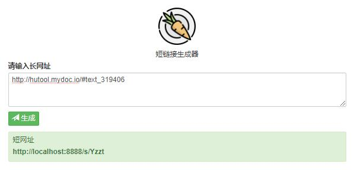

# 短链接

#### 介绍
参考 https://gitee.com/hao_jiayu/urls来写的，采用redis和mysql数据库来存储，采用redis序列（随机递增，不是固定步长），显示字符用的是62进制（0-9a-zA-Z），不过这个62进制不是顺序的，是乱序的（混淆用）

#### 软件架构
这个短链接只是一个练手用的，没有实际用于生产，没有做过多的优化，没有进行并发测试

#### 安装教程

1.  下载项目。项目使用了lombok插件，ide怎么安装lombok，请自行安装
2.  修改application-dev.yml中对应的mysql配置和redis配置信息
3.  运行com.su.shorturl.ShortUrlApplication，启动项目
4.  访问地址http://localhost:8888/s/

#### 使用技术
1. 服务端
    >> springboot 2
    
    >> mysql
    
    >> redis
    
    >> hutool
    
    >> mybatis-plus
    
2. 前端
    >> bootstrap
    
    >> jquery

#### 参考

1.  https://gitee.com/hao_jiayu/urls
2.  https://www.zhihu.com/question/29270034
3.  https://gitee.com/tinyframework/urlshorter
4.  https://gitee.com/zwei1025/short-web-site-service
5.  https://nicky-chen.github.io/2018/10/15/id-redis/

### 短链接的前缀
`GET`:`{BASEURL}/{dynamic-url}`
`GET`:`{BASEURL}/api/short-url/{dynamic-url}`
### 配置短链接的接口参数
`POST`:`{BASEURL}/api/short-url/url/create`
* 是否生成二维码图片
* 强制校验token
* 目标URL
* 动态添加path参数, params字段
    * 参数名 参数类型(固定值,还是el表达式(只支持现有函数,调用第三方服务返回指定结构的数据)) 参数值 参数格式(数字的是几位小数点,时间格式,毫秒级时间戳)
* 动态添加URL参数, params字段
    * 参数名 参数类型(固定值,还是el表达式(只支持现有函数,调用第三方服务返回指定结构的数据)) 参数值 参数格式(数字的是几位小数点,时间格式,秒级时间戳)
* 通过true或者false来决定是否关闭访问, canVisit=true或者false
* 通过是否满足多个表达式决定是否允许访问, 某个时间段内访问, 某些黑名单, 某些浏览器Host访问, 是否允许PC或者APP访问
* 是否添加验证码校验, 密码校验, 例如蚂蚁工资条的用户名校验, 例如短信验证码的校验 
* 是否做访问次数统计

* 参数修改后, 短链接保持原样
* 是否限制每天访问次数 访问上限

1) redis生成随机自增步长的ID
2) 雪花算法生成随机ID
3) 用base62的方式生成短链接的后缀

每次启动时, 现在数据库获取最大的起始数, redis
给短链接生成二维码
`POST`:`{BASEURL}/api/short-url/url/{id}/qrCode`
`PUT`:`{BASEURL}/api/short-url/url/{id}`
短链接还是使用旧的短链接,这样子可以保证旧的短链接还可以使用
`DELETE`:`{BASEURL}/api/short-url/url/{id}`
`DELETE`:`{BASEURL}/api/short-url/url/{batch-delete}`

高级短网址说明：
* 关闭访问：设置为yes短网址将暂时暂时停止访问，如果有设置留言将显示访问留言。例如：http://t.cn/RyG7SfA

匿名访问：隐藏访问来源，使被访问的链接无法最终到来源。例如：http://t.cn/RyG7Y6J

开启统计：将进行简短的访问次数统计

扫码访问：设置为YES后打开短网址将显示原网址的二维图片，方便通过手机访问网址。例如：http://t.cn/RyG7QXn

替换网址：推广过程中可能遇到原网址失效的情况，但短网址已经布到各推广位置不想再重新发布，这种情况可以使用替换网址功能，输入需要替换的网址后访问短网址将转向替换的新网址。例如生成后可以把网址设置指向到百度：http://t.cn/RyG7nlE

访问密码：有些网址只想对局部的用户开放，可以设置访问密码，只有通过密码才能打开短网址。例如：http://t.cn/RyG7rWX，访问密码：iloveyou

访问上限：每个用户可以访问此短网址的次数上限，如果设置为1，那短网址同一个访问者只能访问一次。例如：http://t.cn/RyG7kng

生效时间：有些时候我们像原网址在特定的日期开生效，例如双11才能访问，我们可以把生效日期设置为2015-11-11，这样双十一前发不好的网址也只能在双11当天才可以访问。例如：http://t.cn/RyG7sBh（2015年11月11日才能访问）

结束时间：跟生效时间相反，到达技术时间后短网址件不能访问，并显示访问留言，生效时间和结束时间可以无限次设置，不会因为过了前一次设定的结束时间而短网址失效。例如：http://t.cn/RyGzhZj（2015年9月1日后不能访问）

有效时段：如果你的活动希望在早上10点开始，可以先生成短网址，然后发布推广，然后设置开始时间为10:00-24:00这样，用户只能在10点后访问到你的活动页面。例如：http://t.cn/RyGzZ3F（每天10点后才能访问）

IP黑名单：很明显，这个IP的流浪者无法访问到你发布的短网址

禁止地区：禁止地区里的区域无法访问你发布的短网址，例如你写上杭州，那么整个杭州地区的用户都无法访问你的网站，如果你填上阿里巴巴，那么整个阿里巴巴集团的浏览者都无法浏览到你发布的短网址。例如：http://t.cn/RyGzyP8（杭州地区的同胞都不能访问，其他的都可以）

禁止来源：如果你不想用户通过淘宝网站访问到你的网站，你可以设置http://taobao.com，这样通过http://taobao.com相关的域名都无法访问到你的短网址。例如：http://t.cn/RyGztq0
